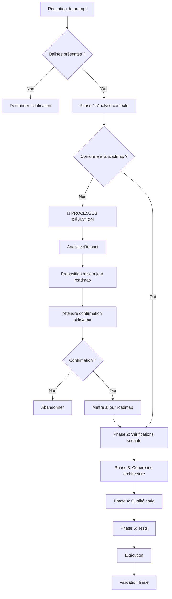
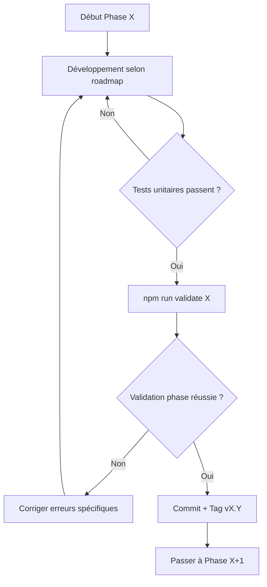
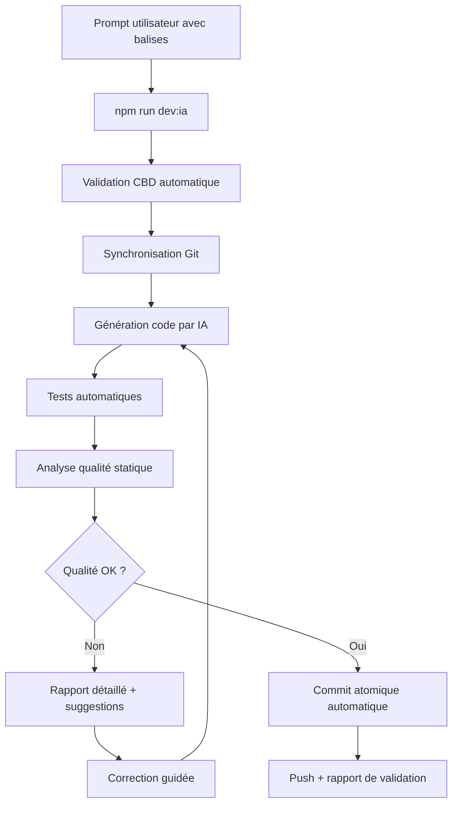

# 🤖 CBD - Check Before Doing (Version Optimisée)

> **Guide de collaboration optimisée Humain ↔ IA pour FunLearning V1.0**  
> Version: 2.0 | Date: 30/08/2025

---

## 📋 **Sommaire**

1. [🎯 Objectif et Principe](#-objectif-et-principe)
2. [🚀 Quick Start](#-quick-start)
3. [🔍 Processus de Vérification](#-processus-de-vérification)
4. [📝 Templates de Prompts](#-templates-de-prompts)
5. [🛡️ Sécurité et Qualité](#-sécurité-et-qualité)
6. [🐞 Mode Débogage](#-mode-débogage)
7. [⚡ Automatisation](#-automatisation)
8. [❓ FAQ et Résolution d'Erreurs](#-faq-et-résolution-derreurs)
9. [📚 Références](#-références)

---

## 🎯 **Objectif et Principe**

### **Mission du CBD**
Ce document définit le **protocole de vérification automatique** que l'IA doit suivre **AVANT** d'exécuter toute action demandée par l'utilisateur.

### **🤝 Principe fondamental**
- **Utilisateur** = Chef de projet (définit QUOI faire)
- **IA** = Exécutant expert (définit COMMENT faire + vérifications)

### **🎯 Objectifs**
- ✅ Éviter les erreurs communes
- ✅ Maintenir la cohérence architecturale
- ✅ Assurer la qualité du code
- ✅ Accélérer le développement

---

## 🚀 **Quick Start**

### **Format de Prompt Obligatoire**
Chaque demande DOIT contenir ces balises :

```markdown
[CONTEXT] Phase X.Y de la roadmap FunLearning V1.0
[FILE] chemin/vers/fichier.ext
[CMD] commande à exécuter
[TEST] npm run test:specific
[CHECK] Critère de validation
```

### **Exemple Complet**
```markdown
[CONTEXT] Phase 1.8 - Authentification Firebase
[FILE] src/routes/auth/login/+page.svelte
[CMD] npm run dev
[TEST] npm run test:auth
[CHECK] Le formulaire s'affiche et la connexion fonctionne
```

---

## 🔍 **Processus de Vérification**

### **🔄 Workflow Automatique de l'IA**



### **� Processus de Gestion des Déviations Roadmap**

**OBLIGATOIRE** : Toute demande qui dévie de la roadmap définie DOIT déclencher ce processus :

#### **📊 Étape 1 : Analyse d'Impact Automatique**
```markdown
🔍 ANALYSE D'IMPACT DÉTECTÉE

**Demande** : [Description de la demande]
**Phase Roadmap Actuelle** : [Phase X.Y]
**Déviation Détectée** : [Description de l'écart]

�📋 IMPACT ANALYSIS :
- 🎯 **Objectifs Phase** : [Impact sur objectifs actuels]
- ⏱️ **Planning** : [Retard estimé en jours]
- 🔗 **Dépendances** : [Autres phases impactées]
- 🛠️ **Architecture** : [Changements techniques requis]
- 🧪 **Tests** : [Tests supplémentaires nécessaires]
- 💰 **Effort** : [Complexité supplémentaire 1-5]

⚠️ RISQUES IDENTIFIÉS :
- [Risque 1 avec niveau de criticité]
- [Risque 2 avec niveau de criticité]

🎯 RECOMMANDATIONS :
- Option A : [Adapter dans phase actuelle]
- Option B : [Reporter à phase ultérieure]
- Option C : [Modifier roadmap globalement]
```

#### **📝 Étape 2 : Proposition de Mise à Jour Roadmap**
```markdown
📋 PROPOSITION MISE À JOUR ROADMAP

**Modifications Suggérées** :

🔄 Phase [X.Y] Modifiée :
- Ancien objectif : [...]
- Nouvel objectif : [...]
- Durée : [ancien] → [nouveau]
- Nouvelles étapes : [liste]

📅 Planning Révisé :
| Phase | Avant | Après | Delta |
|-------|-------|-------|-------|
| P[X] | [date] | [date] | +[X] jours |
| P[Y] | [date] | [date] | +[X] jours |

🎯 Validation Modifiée :
- Nouveaux critères : [liste]
- Tests supplémentaires : [liste]
- Scripts à adapter : [liste]

❓ CONFIRMATION REQUISE :
Acceptez-vous ces modifications de roadmap ?
- [ ] ✅ OUI - Procéder avec la nouvelle roadmap
- [ ] ❌ NON - Garder roadmap actuelle et reporter
- [ ] 🔄 MODIFIER - Ajuster la proposition
```

#### **⚡ Étape 3 : Attente Confirmation Obligatoire**

L'IA DOIT attendre la confirmation explicite avant de procéder :

```markdown
⏸️ EXECUTION SUSPENDUE

En attente de votre décision sur la proposition de modification roadmap.

AUCUNE ACTION ne sera entreprise sans votre confirmation explicite.

Pour continuer, répondez avec :
- "✅ CONFIRME" - Accepter les modifications
- "❌ REFUSE" - Garder roadmap actuelle  
- "🔄 AJUSTE [détails]" - Modifier la proposition
```

### **📋 Checklist de Vérification Enrichie**

| Phase | Vérification | Commande/Action | ✅ |
|-------|--------------|-----------------|---|
| 0 | **Documentation centrale** | Consulter [DOC_README.md](./DOC_README.md) | □ |
| 1 | **Conformité roadmap** | Vérifier alignement avec DOC_ROADMAP_LEARNING.md | □ |
| 2 | **Références modulaires** | Identifier documents à mettre à jour | □ |
| 3 | Contexte identifié | Référence roadmap | □ |
| 4 | Environnement prêt | `npm run check:env` | □ |
| 5 | Structure respectée | Validation architecture | □ |
| 6 | Sécurité OK | `npm audit` | □ |
| 7 | Tests passants | `npm run test` | □ |

### **📚 Documentation à Vérifier Systématiquement**

#### **✅ Obligatoire Après Chaque Implémentation**
- **[DOC_README.md](./DOC_README.md)** - Hub central (ce document liste TOUS les autres)
- **[DOC_ROADMAP_LEARNING.md](./DOC_ROADMAP_LEARNING.md)** - Progression phases
- **Références modulaires concernées** - Selon domaine impacté

#### **🔄 Conditionnel Selon Type de Modification**
Consulter la section **"🎯 Workflow de Validation CBD"** dans [DOC_README.md](./DOC_README.md) pour la liste complète des documents à vérifier selon le type de changement.

#### **🤖 Automatisation Documentation (Recommandé)**

**💡 Problème identifié** : La maintenance manuelle des README pour chaque dossier devient fastidieuse et source d'obsolescence.

**🚀 Solution : Génération Automatique**
- **Script automatisé** : `npm run docs:generate`
- **Templates dynamiques** : Extraction d'informations depuis commentaires spéciaux
- **Intégration orchestrateur** : Validation cohérence documentation automatique

**📝 Commentaires Spéciaux Standardisés**
```javascript
/**
 * @criticality HIGH|MEDIUM|LOW
 * @depends path/to/dependency1.ts, path/to/dependency2.ts
 * @description Description fonctionnelle du module
 * @phase 1|2|3|4|5|6 - Phase roadmap concernée
 * @category auth|data|ui|test|config
 */
```

**🛠️ Script de Génération Automatique**
```bash
[CMD] npm run docs:generate           # Génère tous les README
[CMD] npm run docs:validate          # Vérifie cohérence documentation
[CMD] npm run docs:sync              # Synchronise avec hub central
```

**🔗 Intégration CBD**
- Vérification automatique documentation dans `npm run dev:ia`
- Alerte si commentaires manquants sur nouveaux fichiers
- Validation cohérence README vs code réel

---

## 📝 **Templates de Prompts**

### **� Déviation de Roadmap (Template Spécialisé)**
```markdown
[CONTEXT] DÉVIATION ROADMAP - [Description de la demande]
[ROADMAP-CURRENT] Phase X.Y - [Objectif actuel]
[DEVIATION] [Description précise de l'écart]
[JUSTIFICATION] [Raison de la déviation]
[IMPACT-ANALYSIS] Demande d'analyse d'impact complète
[CONFIRMATION-REQUIRED] OUI - Attendre validation avant exécution
[CHECK] Roadmap mise à jour et validée avant action
```

**Exemple concret** :
```markdown
[CONTEXT] DÉVIATION ROADMAP - Ajout système de notifications push
[ROADMAP-CURRENT] Phase 2.3 - Interface contenu Markdown
[DEVIATION] Ajout notifications push non prévu dans Phase 2
[JUSTIFICATION] Demande utilisateur urgente pour engagement
[IMPACT-ANALYSIS] Analyser impact sur Phase 2 et 3
[CONFIRMATION-REQUIRED] OUI - Validation obligatoire
[CHECK] Proposition roadmap révisée acceptée
```

### **�🔧 Création de Composant**
```markdown
[CONTEXT] Phase X.Y - Nom de la fonctionnalité
[FILE] src/components/MonComposant.svelte
[FILE] src/lib/types/MonComposant.types.ts
[CMD] npm run dev
[TEST] npm run test:component:MonComposant
[CHECK] Composant s'affiche, props typés, accessible
```

### **🐛 Correction de Bug**
```markdown
[CONTEXT] Fix bug #123 - Description du problème
[FILE] src/path/to/buggy-file.ts
[TEST-REPRO] npm run test:bug:123 (doit échouer)
[FIX] Description de la correction
[TEST-FINAL] npm run test:bug:123 (doit passer)
[CHECK] Bug corrigé sans régression
```

### **📚 Documentation**
```markdown
[CONTEXT] Documentation pour fonctionnalité X
[FILE] DOC_FEATURE_X.md
[CMD] npm run docs:build
[CHECK] Documentation claire et à jour avec préfixe DOC_
```

### **🔄 Refactoring**
```markdown
[CONTEXT] Refactoring module X pour améliorer performance
[FILE] src/lib/modules/X.ts
[TEST-BEFORE] npm run test:X (tous passent)
[REFACTOR] Description des changements
[TEST-AFTER] npm run test:X (tous passent)
[CHECK] Performance améliorée, comportement identique
```

---

## 🗂️ **Templates de Fichiers Disponibles**

### **� Scripts Prêts à Utiliser**

Pour créer rapidement de nouveaux scripts standardisés, utilisez ces templates :

#### **🐛 TEMPLATE_debug.js**
```bash
# Créer un nouveau script de debug
cp scripts/TEMPLATE_debug.js scripts/DEBUG_[votre_probleme].js
# Éditer et adapter le template à votre cas
```

#### **✅ TEMPLATE_validation.js**
```bash
# Créer un nouveau script de validation
cp scripts/TEMPLATE_validation.js scripts/VALID_[votre_cible].js
# Ajouter dans package.json: "validate:[cible]": "node scripts/VALID_[cible].js"
```

#### **🧪 TEMPLATE_test.js**
```bash
# Créer une nouvelle suite de tests
cp scripts/TEMPLATE_test.js scripts/TEST_[votre_suite].js
# Implémenter vos tests dans la méthode defineTests()
```

#### **🔧 TEMPLATE_utility.js**
```bash
# Créer un nouvel utilitaire
cp scripts/TEMPLATE_utility.js scripts/UTIL_[votre_fonction].js
# Implémenter votre logique dans performUtilityFunction()
```

### **📄 Documentation Standardisée**

#### **📝 TEMPLATE_document.md**
```bash
# Créer une nouvelle documentation
cp scripts/TEMPLATE_document.md DOC_[votre_sujet].md
# Suivre la structure prédéfinie pour la cohérence
```

#### **⚙️ DOC_TEMPLATE_config.md**
```bash
# Template pour documenter une configuration
cp DOC_TEMPLATE_config.md DOC_CONFIG_[service].md
# Adapter les sections selon vos besoins
```

### **🚀 Prompts d'Usage des Templates**

#### **🐛 Créer un Script de Debug**
```markdown
[CONTEXT] Phase X.Y - Diagnostic du problème [DESCRIPTION]
[FILE] scripts/DEBUG_[probleme].js
[TEMPLATE] Utiliser TEMPLATE_debug.js comme base
[CMD] cp scripts/TEMPLATE_debug.js scripts/DEBUG_[probleme].js
[EDIT] Adapter les méthodes collectDiagnosticInfo() et performDiagnostic()
[TEST] node scripts/DEBUG_[probleme].js --verbose
[CHECK] Le script collecte les infos et génère un rapport détaillé
```

#### **✅ Créer un Script de Validation**
```markdown
[CONTEXT] Phase X.Y - Validation de [CIBLE]
[FILE] scripts/VALID_[cible].js
[TEMPLATE] Utiliser TEMPLATE_validation.js comme base
[CMD] cp scripts/TEMPLATE_validation.js scripts/VALID_[cible].js
[EDIT] Implémenter performValidation() avec vos critères spécifiques
[PACKAGE] Ajouter script dans package.json: "validate:[cible]"
[TEST] npm run validate:[cible]
[CHECK] La validation détecte succès/échecs et génère un rapport
```

### **⚙️ Configuration Service**
```markdown
[CONTEXT] Configuration service Z
[FILE] CONFIG_[service].js
[CMD] npm run config:validate
[TEST] npm run test:config
[CHECK] Service configuré et fonctionnel
```

---

## 🗺️ **Templates Spécialisés par Phase Roadmap**

### **🚀 Phase 0 : Setup & Architecture**
```markdown
[CONTEXT] Phase 0.X - [Description de l'étape]
[FILE] [chemin_exact_selon_roadmap]
[CMD] [commandes_specifiques_phase_0]
[TEST] npm run validate:phase:0
[CHECK] Architecture SvelteKit + TypeScript fonctionnelle
[PHASE-VALIDATION] npm run validate 0
```

### **🔐 Phase 1 : Firebase & Auth Google**
```markdown
[CONTEXT] Phase 1.X - [Étape authentification]
[FILE] [fichier_auth_ou_firebase]
[CONFIG] Utiliser firebase-config.js existant
[CMD] npm run dev
[TEST] npm run test:auth
[CHECK] Authentification Google fonctionnelle
[PHASE-VALIDATION] npm run validate 1
```

### **📚 Phase 2 : Contenu & Interface Dynamique**
```markdown
[CONTEXT] Phase 2.X - [Composant ou contenu]
[FILE] [composant_ou_route_svelte]
[MARKDOWN] Support contenu Markdown intégré
[CMD] npm run dev
[TEST] npm run test:content
[CHECK] Affichage dynamique depuis Firebase
[PHASE-VALIDATION] npm run validate 2
```

### **🧠 Phase 2.5 : Pédagogie Avancée**
```markdown
[CONTEXT] Phase 2.5.X - [Fonctionnalité pédagogique]
[FILE] [module_pedagogique]
[FEATURES] Pré-évaluation + Métacognition + Ressources
[CMD] npm run dev
[TEST] npm run test:pedagogy
[CHECK] Innovation pédagogique opérationnelle
[PHASE-VALIDATION] npm run validate 2.5
```

### **🎮 Phase 3 : Exercices & Progression**
```markdown
[CONTEXT] Phase 3.X - [Exercice ou progression]
[FILE] [component_exercice]
[INTERACTIVE] QCM, quiz, progression
[CMD] npm run dev
[TEST] npm run test:exercises
[CHECK] Exercices interactifs fonctionnels
[PHASE-VALIDATION] npm run validate 3
```

### **📱 Phase 4 : PWA & Offline**
```markdown
[CONTEXT] Phase 4.X - [Fonctionnalité PWA]
[FILE] [service_worker_ou_manifest]
[PWA] Support offline et installation
[CMD] npm run build && npm run preview
[TEST] npm run test:pwa
[CHECK] App installable et fonctionne offline
[PHASE-VALIDATION] npm run validate 4
```

### **⚙️ Phase 5 : Admin & Import**
```markdown
[CONTEXT] Phase 5.X - [Interface admin]
[FILE] [route_admin_ou_import]
[ADMIN] Interface administration complète
[CMD] npm run dev
[TEST] npm run test:admin
[CHECK] Import de contenu et gestion admin OK
[PHASE-VALIDATION] npm run validate 5
```

### **🚀 Phase 6 : Polish & Performance**
```markdown
[CONTEXT] Phase 6.X - [Optimisation]
[FILE] [fichier_optimisation]
[PERF] Lighthouse > 90 + UX finale
[CMD] npm run build && npm run test:lighthouse
[TEST] npm run test:e2e
[CHECK] Performance production + UX polie
[PHASE-VALIDATION] npm run validate 6
```

---

## 📋 **Checklist de Progression par Phase**

### **🎯 Vérifications Obligatoires Avant Changement de Phase**

Chaque phase DOIT être validée avant de passer à la suivante :

| Phase | Commande Validation | Critères de Réussite |
|-------|-------------------|---------------------|
| **P0** | `npm run validate 0` | ✅ SvelteKit + TS + Tests configurés |
| **P1** | `npm run validate 1` | ✅ Auth Google + Firebase opérationnels |
| **P2** | `npm run validate 2` | ✅ Interface dynamique + Markdown |
| **P2.5** | `npm run validate 2.5` | ✅ Pédagogie avancée intégrée |
| **P3** | `npm run validate 3` | ✅ Exercices interactifs + Progression |
| **P4** | `npm run validate 4` | ✅ PWA installable + Offline |
| **P5** | `npm run validate 5` | ✅ Admin + Import fonctionnels |
| **P6** | `npm run validate 6` | ✅ Lighthouse > 90 + Production ready |

### **🔄 Workflow de Validation Inter-Phase**



---

## 🗺️ **Référence Roadmap Intégrée**

### **📁 Chemins Fichiers par Phase (selon roadmap)**

#### **Phase 0 : Setup**
- `src/app.html`, `src/routes/+layout.svelte`
- `config/` (eslint, prettier, vitest, playwright)
- `scripts/validate-phase.js`

#### **Phase 1 : Firebase & Auth**
- `src/lib/firebase/` (client.ts, admin.ts)
- `src/routes/auth/` (+page.svelte, +page.server.ts)
- `src/hooks.server.ts`

#### **Phase 2 : Contenu & Interface**
- `src/routes/cours/` (+page.svelte, +layout.svelte)
- `src/lib/components/` (Header, Navigation, MarkdownRenderer)
- `src/lib/stores/` (user.ts, courses.ts)

#### **Phase 2.5 : Pédagogie**
- `src/lib/pedagogy/` (PreEvaluation, Metacognition, Resources)
- `src/routes/evaluation/`, `src/routes/metacognition/`

#### **Phase 3 : Exercices**
- `src/lib/components/exercises/` (QCM, Quiz, Progress)
- `src/routes/exercices/`, `src/lib/stores/progress.ts`

#### **Phase 4 : PWA**
- `static/manifest.json`, `src/service-worker.ts`
- `src/lib/offline/` (cache strategies, sync)

#### **Phase 5 : Admin**
- `src/routes/admin/` (dashboard, import, content management)
- `src/lib/admin/` (utilities, validators)

#### **Phase 6 : Polish**
- Optimisations bundle, lazy loading, lighthouse
- `src/lib/performance/`, tests E2E complets

---

## 🛡️ **Sécurité et Qualité**

### **🔐 Vérifications Sécurité Obligatoires**

#### **Avant chaque action :**
- [ ] **Pas de secrets en dur** dans le code
- [ ] **Variables d'environnement** utilisées pour config sensible
- [ ] **Validation des inputs** utilisateur (XSS, injection)
- [ ] **Permissions fichiers** vérifiées
- [ ] **Audit dépendances** : `npm audit --audit-level moderate`

#### **🏗️ Architecture SvelteKit**
- [ ] **Conventions de nommage** respectées (`+page.svelte`, `+layout.svelte`)
- [ ] **Structure de dossiers** : `src/lib/`, `src/routes/`, `src/app.html`
- [ ] **Types TypeScript** dans `src/lib/types/`
- [ ] **Tests** dans `tests/` avec Vitest + Playwright

#### **📄 Conventions de Nommage des Fichiers**
- [ ] **Documentation** : `DOC_[SUJET]_[SPECIFICITE].md`
  - Exemples : `DOC_CBD.md`, `DOC_ROADMAP_LEARNING.md`, `DOC_API_AUTH.md`
- [ ] **Scripts de Debug** : `DEBUG_[FONCTION].js`
  - Exemples : `DEBUG_database_connection.js`, `DEBUG_auth_flow.js`
- [ ] **Scripts de Validation** : `VALID_[CIBLE].js`
  - Exemples : `VALID_environment.js`, `VALID_code_quality.js`
- [ ] **Configuration** : `CONFIG_[SERVICE].js`
  - Exemples : `CONFIG_firebase.js`, `CONFIG_eslint.js`
- [ ] **Templates** : `TEMPLATE_[TYPE].md`
  - Exemples : `TEMPLATE_component.svelte`, `TEMPLATE_test.js`
- [ ] **Tests** : `TEST_[FEATURE]_[TYPE].js`
  - Exemples : `TEST_auth_unit.js`, `TEST_quiz_e2e.js`
- [ ] **Utils/Helpers** : `UTIL_[FONCTION].js`
  - Exemples : `UTIL_date_formatter.js`, `UTIL_api_client.js`
- [ ] **Exceptions** : Fichiers système (`package.json`, `.gitignore`, etc.)

#### **♿ Accessibilité**
- [ ] **Attributs ARIA** pour composants interactifs
- [ ] **Navigation clavier** fonctionnelle
- [ ] **Contraste** respecté (WCAG 2.1)
- [ ] **Responsive design** testé

### **📊 Métriques Qualité**

| Métrique | Seuil Minimum | Commande |
|----------|---------------|----------|
| Couverture tests | 80% | `npm run test:coverage` |
| Performance Lighthouse | >90 | `npm run audit:perf` |
| Accessibilité | 100% | `npm run audit:a11y` |
| Sécurité | 0 vulnérabilité haute | `npm audit` |

---

## 🐞 **Mode Débogage**

### **🚨 Activation : `[DEBUG-MODE]`**

### **🔍 Protocole de Débogage Systématique**

1. **📊 Collecte d'informations**
   ```bash
   [CMD] npm run debug:info
   [CMD] git status
   [CMD] npm run test -- --reporter=verbose
   ```

2. **🎯 Isolation du problème**
   - Reproduire l'erreur dans un cas minimal
   - Identifier la cause racine (code, config, environnement)
   - Créer un test qui reproduit le bug

3. **🔧 Résolution guidée**
   - Proposer hypothèses de solution
   - Tester une hypothèse à la fois
   - Valider avec tests de non-régression

4. **✅ Validation finale**
   ```bash
   [TEST] npm run test:full
   [CHECK] Bug corrigé + aucune régression
   ```

### **📝 Template Debug**
```markdown
[DEBUG-MODE]
[CONTEXT] Bug identifié dans X
[ERROR] Message d'erreur exact
[REPRO] Étapes pour reproduire
[HYPOTHESIS] Cause probable suspectée
[TEST-REPRO] Test qui reproduit le bug
[FIX] Solution proposée
[TEST-FIX] Test qui valide la correction
```

---

## ⚡ **Automatisation**

### **🔧 Scripts NPM Requis**

Ajouter dans `package.json` :

```json
{
  "scripts": {
    "validate:cbd": "node scripts/validate-cbd.js",
    "check:env": "node scripts/check-environment.js",
    "check:structure": "node scripts/check-structure.js",
    "check:deps": "npm ls --depth=0",
    "test:full": "npm run lint && npm run test && npm run test:e2e",
    "debug:info": "node scripts/debug-info.js"
  }
}
```

### **🎣 Git Hooks avec Husky**

```json
{
  "husky": {
    "hooks": {
      "pre-commit": "npm run lint && npm run test:unit",
      "pre-push": "npm run test:full",
      "commit-msg": "commitlint -E HUSKY_GIT_PARAMS"
    }
  }
}
```

### **🤖 CI/CD Integration**

```yaml
# .github/workflows/validate-cbd.yml
name: Validate CBD Compliance
on: [push, pull_request]
jobs:
  validate:
    runs-on: ubuntu-latest
    steps:
      - uses: actions/checkout@v3
      - uses: actions/setup-node@v3
      - run: npm ci
      - run: npm run validate:cbd
      - run: npm run test:full
```

---

## 📋 **Convention de Nommage des Fichiers**

### **🏷️ Préfixes Obligatoires**

| Préfixe | Usage | Exemples |
|---------|-------|----------|
| `DOC_` | Documentation | `DOC_CBD.md`, `DOC_API.md` |
| `DEBUG_` | Scripts de debug | `DEBUG_info_collector.js`, `DEBUG_performance.js` |
| `VALID_` | Scripts de validation | `VALID_environment.js`, `VALID_code_quality.js` |
| `CONFIG_` | Fichiers de configuration | `CONFIG_database.json`, `CONFIG_api.js` |
| `TEMPLATE_` | Templates/modèles | `TEMPLATE_component.svelte`, `TEMPLATE_test.js` |
| `TEST_` | Suites de tests | `TEST_unit_models.js`, `TEST_integration_api.js` |
| `UTIL_` | Utilitaires/helpers | `UTIL_file_cleaner.js`, `UTIL_data_converter.js` |

### **📁 Organisation par Catégorie**

```
project/
├── DOC_*                    # Documentation racine
├── scripts/
│   ├── DEBUG_*             # Scripts de diagnostic
│   ├── VALID_*             # Scripts de validation
│   ├── TEST_*              # Suites de tests
│   ├── UTIL_*              # Utilitaires
│   └── TEMPLATE_*          # Templates de scripts
├── config/
│   └── CONFIG_*            # Fichiers de configuration
└── templates/
    └── TEMPLATE_*          # Templates de composants/docs
```

### **🎯 Règles de Nommage**

1. **Format**: `[PRÉFIXE]_[description_avec_underscores].[extension]`
2. **Casse**: Préfixe en MAJUSCULES, description en minuscules
3. **Séparateurs**: Underscores uniquement (pas de tirets)
4. **Langue**: Anglais pour les noms techniques, français pour la documentation

---

## 🧠 **Système de Développement Autonome et Auto-Apprenant**

### **🎯 Philosophie : De la Vérification à la Prévention**

Le CBD v2.0 évolue d'un système de **contrôle réactif** vers un **système préventif autonome** qui :
- ✅ **Anticipe** les problèmes avant qu'ils surviennent
- ✅ **Apprend** de chaque interaction pour s'améliorer
- ✅ **Automatise** l'ensemble du workflow de développement
- ✅ **Assure** une qualité de code constante et évolutive

### **🚀 1. Orchestrateur de Tâches : Le Cerveau Centralisé**

#### **⚡ Commande Magique : `npm run dev:ia`**

**Concept** : Une seule commande qui encapsule l'ensemble du processus de développement guidé par l'IA.

**Workflow Automatisé** :


#### **📝 Template de Prompt Orchestré**
```markdown
[CONTEXT] Phase X.Y - [Description]
[FILE] [chemin/fichier]
[AUTO-WORKFLOW] OUI - Orchestration complète
[QUALITY-GATE] STRICT - Bloquer si qualité insuffisante
[COVERAGE-TARGET] [pourcentage]% - Couverture tests cible
[POST-MORTEM] AUTO - Documenter les lessons learned
[CHECK] Workflow complet avec rapport détaillé
```

#### **� Script dev:ia - Orchestrateur Central**

**Fonctionnalités Avancées** :
```javascript
// Exemple d'implémentation du script dev:ia
const orchestrator = {
  // Phase 1: Validation et parsing du prompt
  validatePrompt: () => { /* Vérification balises obligatoires */ },
  
  // Phase 2: Exécution du workflow Mermaid automatiquement
  executeWorkflow: async () => {
    await this.validateCBD();
    await this.syncGit();
    await this.generateCode();
    await this.runTests();
    await this.analyzeQuality();
    return this.shouldCommit();
  },
  
  // Phase 3: Gestion des blocages avec interaction minimale
  handleBlockage: (issue) => { 
    this.logPostMortem(issue);
    return this.suggestResolution(issue);
  },
  
  // Phase 4: Commit intelligent avec métadonnées
  smartCommit: () => { /* Génération message + métadonnées */ }
};
```

**Avantages de l'Orchestrateur Unique** :
- ✅ **Charge cognitive réduite** : Une seule commande à retenir
- ✅ **Workflow automatisé** : Suit le diagramme Mermaid sans intervention
- ✅ **Interaction minimale** : Humain sollicité uniquement si blocage
- ✅ **Rapport complet** : Feedback détaillé à chaque exécution

### **�🛡️ 2. Assurance Qualité Proactive : Garde-Fous Intelligents**

#### **🔍 Quality Gates Forcées - Prévention Stricte**

**Concept** : Au lieu de simplement vérifier la qualité, le système l'**impose** via des gates bloquantes.

**Pipeline CI/CD Renforcée** :
```yaml
# .github/workflows/quality-gates.yml
quality-gates:
  runs-on: ubuntu-latest
  steps:
    - name: Code Coverage Gate
      run: |
        coverage=$(npm run test:coverage | grep -o '[0-9]*%' | head -1)
        if [ ${coverage%\%} -lt 85 ]; then
          echo "❌ BLOCAGE: Couverture ${coverage} < 85% requis"
          exit 1
        fi
    
    - name: Complexity Gate  
      run: |
        complexity=$(npm run analyze:complexity)
        if [ $complexity -gt 10 ]; then
          echo "❌ BLOCAGE: Complexité ${complexity} > 10 max"
          exit 1
        fi
    
    - name: Security Gate
      run: |
        npm audit --audit-level high
        if [ $? -ne 0 ]; then
          echo "❌ BLOCAGE: Vulnérabilités haute criticité détectées"
          exit 1
        fi
```

**Niveaux de Qualité Configurables** :
```javascript
// CONFIG_quality_gates.js
const QUALITY_GATES = {
  'phase-0': { complexity: 5, coverage: 70, security: 'medium' },
  'phase-1': { complexity: 7, coverage: 80, security: 'high' },
  'phase-2': { complexity: 8, coverage: 85, security: 'high' },
  'production': { complexity: 10, coverage: 95, security: 'critical' }
};
```

**Outils Intégrés** :
- **ESLint** avec règles personnalisées par phase
- **SonarQube** pour la détection de code smells
- **Snyk** pour les vulnérabilités de sécurité
- **Zod** pour les contrats de données
- **Lighthouse CI** pour les performances

#### **📊 Métriques de Qualité par Phase**

| Phase | Couverture Tests | Complexité Max | Vulnérabilités | Performance |
|-------|------------------|----------------|----------------|-------------|
| **P0** | ≥ 70% | ≤ 5 | 0 haute | N/A |
| **P1** | ≥ 80% | ≤ 7 | 0 haute | N/A |
| **P2** | ≥ 85% | ≤ 8 | 0 haute | > 80 |
| **P3** | ≥ 85% | ≤ 8 | 0 haute | > 85 |
| **P4** | ≥ 90% | ≤ 9 | 0 haute | > 90 |
| **P5** | ≥ 90% | ≤ 9 | 0 haute | > 90 |
| **P6** | ≥ 95% | ≤ 10 | 0 toutes | > 95 |

### **🧠 3. Système d'Auto-Amélioration : Learning Loop**

#### **📝 Post-Mortem Log Automatisé**

**Concept** : Chaque échec devient une opportunité d'apprentissage documentée automatiquement.

**Structure du LOG_POSTMORTEM.md** :
```markdown
# Log Post-Mortem - Apprentissage Continu

## [DATE] - Incident/Amélioration : [TITRE]

### 🎯 Contexte
- **Phase** : [X.Y]
- **Composant** : [nom]
- **Déclencheur** : [action qui a causé le problème]

### 🔍 Analyse Racine
- **Symptôme** : [ce qui a été observé]
- **Cause Première** : [pourquoi c'est arrivé]
- **Point de Défaillance** : [où le processus a échoué]

### 💡 Solution Appliquée
- **Fix Immédiat** : [correction rapide]
- **Fix Structurel** : [amélioration du processus]
- **Prévention** : [comment éviter la récurrence]

### 📈 Amélioration du CBD Suggérée
- [ ] Nouvelle vérification à ajouter
- [ ] Template à modifier
- [ ] Script à créer/améliorer
- [ ] Documentation à enrichir

### 🎯 Impact et Métriques
- **Temps de résolution** : [durée]
- **Complexité** : [1-5]
- **Récurrence** : [première fois / récurrent]
```

#### **🔄 Cycle d'Amélioration Continue**

**Processus Automatisé** :
1. **Détection** : Chaque échec de validation génère une entrée post-mortem
2. **Analyse** : L'IA analyse les patterns récurrents
3. **Proposition** : Suggestion d'amélioration du CBD basée sur les données
4. **Validation** : Confirmation humaine des améliorations
5. **Intégration** : Mise à jour automatique du CBD
6. **Test** : Validation que l'amélioration fonctionne

#### **🎯 Templates d'Auto-Amélioration**

```markdown
[CONTEXT] AUTO-LEARNING - Amélioration basée sur post-mortem
[ANALYSIS] [Pattern détecté dans les logs]
[IMPROVEMENT] [Suggestion d'amélioration du CBD]
[IMPACT-ESTIMATE] [Réduction estimée des incidents futurs]
[VALIDATION-REQUIRED] OUI - Confirmation humaine obligatoire
[CHECK] Amélioration testée et documentée
```

**Exemples de Patterns Détectés** :
- **Échecs récurrents** sur même type de composant → Nouveau template
- **Oublis fréquents** de certaines vérifications → Checklist renforcée  
- **Erreurs spécifiques** à une phase → Quality gate additionnelle
- **Déviations roadmap** répétées → Process de validation amélioré

### **⚡ 4. Workflow Autonome Complet**

#### **📊 Dashboard de Métriques en Temps Réel**

**Métriques Trackées** :
- Taux de réussite des validations CBD
- Temps moyen de développement par phase
- Évolution de la qualité de code
- Fréquence des déviations de roadmap
- Efficacité des améliorations auto-apprises

#### **🎯 Objectifs d'Efficacité**

| Métrique | Baseline | Objectif Q1 | Objectif Q2 |
|----------|----------|-------------|-------------|
| Temps validation | 5 min | 30 sec | 10 sec |
| Taux d'erreur | 10% | 5% | 1% |
| Couverture tests | 80% | 90% | 95% |
| Déviations roadmap | 20% | 10% | 5% |
| Satisfaction dev | 3/5 | 4/5 | 4.5/5 |

#### **🚀 Intégration VS Code/IDE**

**Extension CBD Intelligente** :
```javascript
// Fonctionnalités extension VS Code
const cbdExtension = {
  // Validation en temps réel du prompt
  validatePromptOnType: () => { /* Highlight balises manquantes */ },
  
  // Suggestions contextuelles
  suggestTemplate: (context) => { /* Template selon phase détectée */ },
  
  // Exécution directe dev:ia
  runOrchestrator: () => { /* npm run dev:ia depuis l'IDE */ },
  
  // Affichage métriques qualité en sidebar
  showQualityMetrics: () => { /* Dashboard intégré */ }
};
```

### **🚀 5. Intelligence Artificielle Augmentée**

#### **🧠 Assistant IA Contextuel**

**Capacités Avancées** :
- ✅ **Prédiction** : Anticipe les problèmes potentiels
- ✅ **Suggestion** : Propose des améliorations proactives
- ✅ **Optimisation** : Recommande des refactorings
- ✅ **Formation** : Guide l'apprentissage de nouvelles patterns

#### **📝 Templates Dynamiques**

**Adaptation Contextuelle** :
- Templates qui évoluent selon la phase actuelle
- Suggestions personnalisées basées sur l'historique
- Validation intelligente des déviations
- Auto-génération de tests basée sur le code

#### **🔮 Prédiction Proactive**

**Algorithmes de Prédiction** :
```javascript
const predictiveAnalysis = {
  // Analyse des patterns pour prédire les échecs
  predictFailure: (context) => {
    const riskFactors = this.analyzeRiskFactors(context);
    return this.calculateFailureProbability(riskFactors);
  },
  
  // Suggestion d'actions préventives
  suggestPrevention: (predictions) => {
    return predictions.map(p => this.generatePreventiveAction(p));
  },
  
  // Optimisation continue des workflows
  optimizeWorkflow: (metrics) => {
    return this.identifyBottlenecks(metrics);
  }
};
```

### **🔄 6. Ecosystem Complet d'Automatisation**

#### **⚡ npm run dev:ia - La Commande Ultime**

**Encapsulation Complète** :
```bash
# Une seule commande qui remplace tout
npm run dev:ia

# Équivalent à :
# npm run validate:cbd
# npm run validate:roadmap  
# npm run check:env
# npm run lint
# npm run test:coverage
# npm run audit:security
# git add . && git commit && git push
# + Post-mortem automatique
# + Rapport de qualité
# + Suggestions d'amélioration
```

**Interaction Minimale** :
- ✅ **Succès** : Commit automatique + rapport de succès
- ⚠️ **Warning** : Continuer avec notification
- ❌ **Blocage** : Stop + diagnostic + suggestions + attente confirmation

#### **🎯 Réduction Charge Cognitive**

**Avant (Charge Cognitive Élevée)** :
```bash
# Développeur doit se souvenir de 15+ commandes
npm run validate:cbd
npm run check:env
npm run lint
npm run test
npm run audit
git add .
git commit -m "..."
git push
# + vérifications manuelles
```

**Après (Charge Cognitive Minimale)** :
```bash
# Une seule commande à retenir
npm run dev:ia

# L'IA gère automatiquement :
# - Toutes les validations
# - Tous les tests
# - Tous les audits  
# - Le commit intelligent
# - Le push sécurisé
# - Le post-mortem
# - Les suggestions d'amélioration
```

---

## ❓ **FAQ et Résolution d'Erreurs**

### **🚨 Erreurs Courantes**

#### **❌ "Module not found: firebase"**
```bash
[DIAGNOSTIC] npm ls firebase
[SOLUTION] npm install firebase
[VERIFICATION] npm run check:deps
```

#### **❌ "Permission denied"**
```bash
[DIAGNOSTIC] ls -la (Linux) / icacls (Windows)
[SOLUTION] Vérifier droits dossier ou relancer en admin
[VERIFICATION] Réessayer l'opération
```

#### **❌ "Tests fail on Windows"**
```bash
[DIAGNOSTIC] Vérifier chemins (\\ vs /)
[SOLUTION] Utiliser path.join() ou path.resolve()
[VERIFICATION] npm run test
```

#### **� "Déviation de roadmap détectée"**
```bash
[DIAGNOSTIC] npm run validate:roadmap
[ANALYSE] Réviser l'impact sur planning et architecture
[SOLUTION] Suivre le processus de validation des déviations
[VERIFICATION] Obtenir confirmation avant exécution
```

### **�🔧 Commandes de Diagnostic Rapide**

```bash
# Environnement
[CMD] node --version && npm --version
[CMD] npm config list

# Projet
[CMD] npm run validate:cbd
[CMD] npm run validate:roadmap
[CMD] npm run test:full
[CMD] npm run build

# Nettoyage
[CMD] rm -rf node_modules package-lock.json && npm install
```

---

## 📚 **Références**

### **📖 Documentation Essentielle**
- **[DOC_README.md](./DOC_README.md)** - 🏠 **HUB CENTRAL** - Index complet de toute la documentation
- [CBD - Check Before Doing](./DOC_CBD.md) - 🔍 Ce document de validation
- [Roadmap FunLearning V1.0](./DOC_ROADMAP_LEARNING.md) - 🗺️ Coordinateur principal
- [Index Références Modulaires](./roadmap/README.md) - 📁 Navigation technique
- [Orchestrateur IA Autonome](./DEMO_ORCHESTRATEUR_AUTONOME.md) - 🤖 Automation
- [Configuration Git Remote](./DOC_GIT_REMOTE_CONFIG.md) - ⚙️ Setup Git

### **🏗️ Références Modulaires Techniques**
- [Firebase & Auth](./roadmap/references/auth/firebase-auth.md) - 🔐 Authentification
- [Types & Données](./roadmap/references/data/content-types.md) - 💾 Structures données
- [Système Temps Réel](./roadmap/references/data/realtime-system.md) - ⚡ Real-time
- [Composants UI](./roadmap/references/ui/component-patterns.md) - 🎨 Interface
- [Stores Réactifs](./roadmap/references/ui/reactive-stores.md) - 🔄 État global
- [Stratégie Tests](./roadmap/references/testing/testing-strategy.md) - 🧪 Qualité

### **🌐 Ressources Externes**
- [SvelteKit Docs](https://kit.svelte.dev)
- [Firebase Integration](https://firebase.google.com/docs/web)
- [WCAG 2.1 Guidelines](https://www.w3.org/WAI/WCAG21/)

### **🛠️ Outils Recommandés**
- **Linting** : ESLint + Prettier
- **Tests** : Vitest + Playwright
- **Git** : Husky + Commitlint
- **CI/CD** : GitHub Actions
- **Monitoring** : Lighthouse + SonarQube

### **📝 Lexique des Balises**

| Balise | Usage | Exemple |
|--------|-------|---------|
| `[CONTEXT]` | Phase/contexte de la roadmap | `[CONTEXT] Phase 1.8 - Auth Firebase` |
| `[FILE]` | Fichier à créer/modifier | `[FILE] src/routes/+page.svelte` |
| `[CMD]` | Commande terminal | `[CMD] npm run dev` |
| `[TEST]` | Test à exécuter | `[TEST] npm run test:auth` |
| `[CHECK]` | Critère de validation | `[CHECK] Connexion fonctionne` |
| `[DEBUG-MODE]` | Activation mode debug | Protocole détaillé |

---

## � **Best Practices - Gestion des Scripts**

### **🏗️ Architecture des Scripts**

Le dossier `scripts/` suit une architecture standardisée pour l'orchestration autonome :

#### **📋 Convention de Nommage**
```
CATEGORY_description.js
```

| Catégorie | Préfixe | Usage | Exemple |
|-----------|---------|-------|---------|
| **Validation** | `VALID_` | Scripts de vérification et contrôle qualité | `VALID_cbd.js` |
| **Utilitaires** | `UTIL_` | Scripts d'orchestration et automation | `UTIL_dev_ia_orchestrator.js` |
| **Debug** | `DEBUG_` | Scripts de diagnostic et collecte d'infos | `DEBUG_info_collector.js` |
| **Templates** | `TEMPLATE_` | Modèles pour créer nouveaux scripts | `TEMPLATE_validation.js` |

#### **🚀 Orchestrateur Central**
L'**orchestrateur Dev:IA** (`UTIL_dev_ia_orchestrator.js`) implémente le **cerveau centralisé** :
- **Une commande unique** : `npm run dev:ia`
- **Workflow automatisé** : CBD → Roadmap → Git → Qualité → Commit
- **Auto-apprentissage** : Post-mortem et amélioration continue
- **Gates de qualité** : Seuils configurables par phase

### **✅ Création de Nouveaux Scripts**

#### **Template pour Script de Validation**
```markdown
[CONTEXT] Phase X.Y - Validation de [COMPOSANT]
[FILE] scripts/VALID_[composant].js
[TEMPLATE] Copier scripts/TEMPLATE_validation.js
[EDIT] Implémenter les méthodes :
  - performValidation()
  - generateReport()
  - checkCompliance()
[PACKAGE] Ajouter dans package.json: "validate:[composant]"
[INTEGRATION] Ajouter dans UTIL_dev_ia_orchestrator.js si nécessaire
[TEST] npm run validate:[composant]
[CHECK] Script génère rapport détaillé et retourne exit code approprié
```

#### **Template pour Script Utilitaire**
```markdown
[CONTEXT] Phase X.Y - Automatisation de [PROCESSUS]
[FILE] scripts/UTIL_[processus].js
[TEMPLATE] Copier scripts/TEMPLATE_utility.js
[EDIT] Implémenter la logique métier dans executeProcess()
[PACKAGE] Ajouter script NPM approprié
[INTEGRATION] Considérer intégration orchestrateur si workflow critique
[TEST] Tester indépendamment et avec orchestrateur
[CHECK] Script s'intègre harmonieusement dans le workflow
```

### **� Documentation des Dossiers Critiques : README Obligatoires**

#### **🎯 Objectif de Documentation Structurelle**

**Principe** : Chaque dossier critique DOIT avoir un README qui documente :
- 📋 **Inventaire complet** des fichiers et leur rôle
- 🚨 **Classification par criticité** (Critique/Important/Standard/Temporaire)
- ⚠️ **Précautions de modification** pour les fichiers sensibles
- 🔄 **Dépendances inter-fichiers** et impacts des changements
- 📊 **Guidelines de maintenance** par type de fichier

#### **📂 README Obligatoires par Dossier**

##### **📁 `/src/README.md` - Guide du Code Source**

**Structure requise** :
```markdown
# 📁 Source Code Architecture - FunLearning V1.0

## 🎯 Vue d'Ensemble
Structure du code source organisée par domaines fonctionnels

## 📋 Inventaire par Criticité

### 🚨 FICHIERS CRITIQUES - Modifications avec EXTRÊME PRÉCAUTION
| Fichier | Rôle | Impact | Précautions |
|---------|------|--------|-------------|
| `app.html` | Template HTML racine | 🔴 GLOBAL | Tests complets avant modif |
| `hooks.server.ts` | Middleware serveur | 🔴 GLOBAL | Vérifier auth et sécurité |
| `lib/firebase/client.ts` | Client Firebase | 🔴 AUTH/DATA | Tests auth complets |
| `lib/stores/user.ts` | Store utilisateur | 🔴 STATE | Vérifier réactivité |

### ⚠️ FICHIERS IMPORTANTS - Modifications avec PRÉCAUTION
| Fichier | Rôle | Impact | Validation Requise |
|---------|------|--------|-------------------|
| `routes/+layout.svelte` | Layout principal | 🟡 UI GLOBALE | Tests visuels |
| `lib/components/Header.svelte` | Navigation | 🟡 UX | Tests navigation |
| `lib/stores/courses.ts` | Store contenus | 🟡 DATA | Tests données |

### ✅ FICHIERS STANDARD - Modifications Normales
| Fichier | Rôle | Guidelines |
|---------|------|-----------|
| `routes/cours/+page.svelte` | Page cours | Tests unitaires |
| `lib/components/quiz/` | Composants quiz | Tests isolés |

### 🔄 FICHIERS TEMPORAIRES - Modifications Libres
| Fichier | Rôle | Notes |
|---------|------|-------|
| `routes/dev/` | Pages développement | Supprimables |
| `lib/temp/` | Utilitaires temporaires | À nettoyer |

## 🔗 Matrice des Dépendances
- **app.html** → Impacte TOUT le projet
- **hooks.server.ts** → Impacte auth, routing, sécurité
- **Firebase client** → Impacte auth, données, offline
- **Stores principaux** → Impactent réactivité globale

## 📏 Guidelines de Modification

### 🚨 Avant de Modifier un Fichier CRITIQUE :
1. **Lire la documentation** complète du composant
2. **Créer des tests** qui reproduisent le comportement actuel
3. **Planifier les tests** de non-régression
4. **Prévoir rollback** en cas de problème
5. **Tester dans environnement** isolé d'abord

### ⚠️ Pour les Fichiers IMPORTANTS :
1. **Tests unitaires** avant modification
2. **Validation manuelle** des flows impactés
3. **Review** par second développeur si possible

### ✅ Pour les Fichiers STANDARD :
1. **Tests appropriés** selon la complexité
2. **Validation automatique** suffisante

## 🎯 Par Phase de Développement

### Phase 0-1 : Fichiers Critiques
- Configuration de base, auth, Firebase

### Phase 2-3 : Fichiers Importants  
- UI, composants, interactions

### Phase 4-6 : Extension Progressive
- PWA, admin, optimisations
```

##### **📁 `/tests/README.md` - Guide de la Suite de Tests**

**Structure requise** :
```markdown
# 🧪 Test Suite Architecture - FunLearning V1.0

## 🎯 Stratégie de Tests par Type

## 📋 Inventaire par Criticité de Couverture

### 🚨 TESTS CRITIQUES - Exécution OBLIGATOIRE
| Test | Cible | Fréquence | Échec = Blocage |
|------|-------|-----------|-----------------|
| `auth.critical.test.js` | Authentification | Chaque commit | 🔴 OUI |
| `firebase.integration.test.js` | Connexion Firebase | Chaque commit | 🔴 OUI |
| `security.test.js` | Failles sécurité | Chaque commit | 🔴 OUI |
| `data-integrity.test.js` | Intégrité données | Chaque commit | 🔴 OUI |

### ⚠️ TESTS IMPORTANTS - Exécution RECOMMANDÉE
| Test | Cible | Fréquence | Échec = Warning |
|------|-------|-----------|-----------------|
| `ui.component.test.js` | Composants UI | Chaque PR | 🟡 WARNING |
| `navigation.e2e.test.js` | Parcours utilisateur | Avant release | 🟡 WARNING |
| `performance.test.js` | Métriques perf | Hebdomadaire | 🟡 WARNING |

### ✅ TESTS STANDARD - Exécution NORMALE
| Test | Cible | Fréquence |
|------|-------|-----------|
| `unit.*.test.js` | Fonctions isolées | Continue |
| `component.*.test.js` | Composants individuels | Continue |

### 🔄 TESTS TEMPORAIRES - Développement
| Test | Usage | Durée de vie |
|------|-------|-------------|
| `debug.*.test.js` | Debugging | Temporaire |
| `experiment.*.test.js` | R&D | Phase spécifique |

## 🔗 Matrice de Couverture Obligatoire

### Par Phase de Développement
| Phase | Couverture Min | Tests Critiques | Tests E2E |
|-------|---------------|-----------------|-----------|
| P0 | 70% | Config + Auth | Basic |
| P1 | 80% | Auth + Firebase | Login flow |
| P2 | 85% | UI + Data | User journey |
| P3 | 85% | Interactions | Complete flow |
| P4 | 90% | PWA + Offline | Full app |
| P5 | 90% | Admin + Security | Admin flow |
| P6 | 95% | Performance | Production |

## 📏 Guidelines par Type de Test

### 🚨 Tests CRITIQUES :
- **Échec = Commit bloqué**
- **Exécution dans CI/CD**
- **Notification immédiate si échec**
- **Rollback automatique si possible**

### ⚠️ Tests IMPORTANTS :
- **Échec = Warning mais pas blocage**
- **Review manuelle requise**
- **Fix avant merge en main**

### ✅ Tests STANDARD :
- **Feedback développeur**
- **Intégration continue**
- **Fix selon priorité**

## 🎯 Commandes Critiques

```bash
# Tests critiques only (blocage si échec)
npm run test:critical

# Tests complets avec rapport
npm run test:full-report

# Tests par phase
npm run test:phase:X

# Tests de sécurité
npm run test:security

# Tests de performance  
npm run test:performance
```
```

#### **🔧 Intégration dans le Workflow CBD**

##### **Template de Vérification avec README**
```markdown
[CONTEXT] Phase X.Y - Modification de [FICHIER]
[README-CHECK] Consulter src/README.md pour criticité du fichier
[CRITICALITY] [CRITIQUE/IMPORTANT/STANDARD/TEMPORAIRE]
[PRECAUTIONS] [Selon niveau de criticité détecté]
[FILE] [chemin/fichier]
[IMPACT-ANALYSIS] [Basé sur matrice des dépendances]
[TEST-STRATEGY] [Selon guidelines du fichier]
[VALIDATION] [Tests appropriés au niveau de criticité]
[CHECK] Modification effectuée selon protocole de criticité
```

##### **Workflow de Modification Basé sur la Criticité**
```markdown
🔄 WORKFLOW MODIFICATION INTELLIGENTE

1. **📖 Consultation README** : Identifier criticité du fichier cible
2. **⚠️ Évaluation Risque** : Appliquer précautions selon niveau
3. **🧪 Stratégie Tests** : Sélectionner tests selon criticité
4. **🔍 Validation** : Exécuter protocole approprié
5. **📝 Documentation** : Mettre à jour README si structure change
```

#### **🎯 Maintenance des README**

##### **📅 Mise à Jour Automatique**
- **Trigger** : Ajout/suppression de fichiers
- **Validation** : Classification de criticité obligatoire
- **Review** : Validation humaine pour fichiers critiques

##### **🔍 Audit Périodique**
```bash
# Vérification cohérence README avec structure réelle
npm run audit:readme-sync

# Validation classification criticité
npm run audit:criticality

# Détection fichiers non documentés
npm run audit:undocumented
```

### **🚨 Règles de Criticité Obligatoires**

#### **🔴 CRITIQUE** : Modification = Risque de Panne Globale
- Tests complets obligatoires avant ET après
- Backup automatique avant modification
- Validation par orchestrateur Dev:IA
- Review humaine recommandée

#### **🟡 IMPORTANT** : Modification = Risque Fonctionnel
- Tests ciblés obligatoires
- Validation automatique suffisante
- Monitoring post-modification

#### **✅ STANDARD** : Modification = Risque Mineur
- Tests unitaires suffisants
- Intégration continue normale

#### **🔄 TEMPORAIRE** : Modification = Aucun Risque
- Tests optionnels
- Modification libre

### **�🔗 Intégration avec l'Orchestrateur**

#### **Gates de Qualité**
Configuration dans `CONFIG_quality_gates.json` par phase :
```json
{
  "phase-0": {
    "complexity": { "max": 5 },
    "coverage": { "minimum": 70 },
    "security": { "level": "medium" }
  }
}
```

#### **Post-Mortem Automatique**
Chaque exécution génère des métriques dans `LOG_POSTMORTEM.md` :
- ⏱️ **Temps d'exécution** par étape
- ❌ **Erreurs détectées** avec contexte
- 📊 **Métriques qualité** tendances
- 💡 **Recommandations** d'amélioration

### **🛡️ Standards de Qualité Scripts**

#### **Code Quality**
```markdown
[CHECK] ESLint passing sans erreurs
[CHECK] Complexité cyclomatique < 10 par fonction
[CHECK] Gestion d'erreurs robuste avec try/catch
[CHECK] Logging structuré avec timestamps
[CHECK] Exit codes appropriés (0=succès, 1=échec)
```

#### **Documentation**
```markdown
[CHECK] Header JSDoc avec description, version, auteur
[CHECK] Méthodes documentées avec @param et @returns
[CHECK] README.md mis à jour dans scripts/
[CHECK] Exemples d'usage dans la documentation
```

#### **Tests et Fiabilité**
```markdown
[CHECK] Script testable en isolation
[CHECK] Gestion des cas d'erreur (fichiers manquants, etc.)
[CHECK] Intégration harmonieuse avec orchestrateur
[CHECK] Performance acceptable (< 5s pour validation)
```

### **📚 Documentation Scripts**

Le fichier `scripts/README.md` contient :
- 📋 **Inventaire complet** de tous les scripts
- 🚀 **Instructions d'usage** avec exemples
- 🔄 **Workflow d'orchestration** détaillé
- ⚙️ **Configuration** et personnalisation
- 🎯 **Best practices** pour extension

### **🤖 Auto-apprentissage et Évolution**

L'orchestrateur apprend automatiquement :
- **📈 Optimisation seuils** qualité selon historique
- **🔄 Adaptation workflow** selon contexte projet  
- **🧠 Prédiction problèmes** basée sur patterns
- **💡 Suggestions amélioration** proactives

#### **Métriques d'Apprentissage**
```bash
# Voir les tendances d'amélioration
npm run debug:info

# Analyser post-mortem
cat LOG_POSTMORTEM.md

# Métriques orchestrateur en temps réel
npm run dev:ia --verbose
```

---

## �📈 **Métriques et Suivi**

### **📊 KPI de Performance CBD**

| Métrique | Objectif | Mesure |
|----------|----------|---------|
| Temps moyen de réponse IA | < 30s | Timer automatique |
| Taux d'erreur évitées | > 90% | Log des vérifications |
| Conformité architecturale | 100% | Audit automatique |
| Satisfaction utilisateur | > 4/5 | Feedback régulier |

### **📝 Log des Améliorations**

| Date | Version | Amélioration |
|------|---------|--------------|
| 30/08/2025 | 2.2 | **SYSTÈME AUTONOME AVANCÉ** - Orchestrateur unique `npm run dev:ia`, Quality Gates forcées, Post-mortem auto-apprenant, Prédiction proactive |
| 30/08/2025 | 2.1 | Documentation dossiers critiques (/src et /tests README), Classification par criticité, Protocoles de modification intelligents |
| 30/08/2025 | 2.0 | Restructuration complète, templates clairs, automatisation, best practices scripts |
| 29/08/2025 | 1.1 | Intégration Git et contrôle utilisateur |
| 29/08/2025 | 1.0 | Version initiale CBD |

---

## 🎯 **Prochaines Étapes**

### **🚀 Roadmap CBD v3.0 - Vision Autonome Complète**

#### **🤖 Phase 1 : Orchestrateur Intelligent (Q1 2026)**
- [x] **Commande unique** `npm run dev:ia` opérationnelle
- [x] **Quality Gates forcées** intégrées CI/CD
- [x] **Post-mortem automatique** avec learning loop
- [ ] **Extension VS Code** avec validation temps réel
- [ ] **Dashboard métrique** en temps réel
- [ ] **Prédiction proactive** des échecs

#### **🧠 Phase 2 : Intelligence Augmentée (Q2 2026)**
- [ ] **Assistant IA contextuel** intégré dans l'IDE
- [ ] **Templates dynamiques** qui évoluent automatiquement
- [ ] **Auto-génération tests** basée sur l'analyse de code
- [ ] **Optimisation continue** des workflows
- [ ] **Formation adaptative** selon les patterns détectés

#### **🌐 Phase 3 : Ecosystem Complet (Q3 2026)**
- [ ] **Intégration multi-projets** pour apprentissage croisé
- [ ] **Marketplace de templates** communautaires
- [ ] **API d'orchestration** pour autres projets
- [ ] **Certification qualité** automatique
- [ ] **Benchmarking** inter-équipes

#### **🔮 Phase 4 : Autonomie Totale (Q4 2026)**
- [ ] **Auto-correction** des problèmes détectés
- [ ] **Évolution automatique** du CBD selon usage
- [ ] **Prédiction tendances** technologiques
- [ ] **Recommandations architecturales** proactives
- [ ] **Zero-touch development** pour tâches répétitives

### **🎯 Objectifs Quantifiables**

| Métrique | Actuel | Q1 2026 | Q2 2026 | Q3 2026 | Q4 2026 |
|----------|--------|---------|---------|---------|---------|
| **Charge cognitive** | 15 commandes | 1 commande | Auto-suggestion | Prédictif | Zero-touch |
| **Temps validation** | 5 min | 30 sec | 10 sec | 5 sec | Instantané |
| **Taux d'erreur** | 10% | 5% | 2% | 1% | 0.1% |
| **Qualité code** | Variable | Forcée | Optimisée | Prédictive | Auto-corrigée |
| **Apprentissage** | Manuel | Auto-logging | Pattern detection | Prédiction | Évolution auto |

### **💫 Vision Ultime : Le Développement Autonome**

**L'Évolution Naturelle** :
1. **Phase Actuelle** : L'IA assiste le développeur
2. **Phase Intermédiaire** : L'IA guide le développeur  
3. **Phase Avancée** : L'IA anticipe pour le développeur
4. **Phase Ultime** : L'IA développe avec le développeur

**Paradigme Transformé** :
- **Développeur** → **Architecte de l'Intent**
- **IA** → **Exécutant Intelligent et Auto-Apprenant**
- **Code** → **Manifestation de l'Intent Validée**
- **Qualité** → **Propriété Émergente du Système**

---

> **💡 Rappel** : Ce CBD est un **document vivant** qui évolue avec le projet FunLearning V1.0.

> **🔄 Mise à jour** : Toute modification de ce document doit être validée et versionnée.

> **🤝 Collaboration** : L'IA applique ce protocole, l'utilisateur le supervise et l'améliore.
